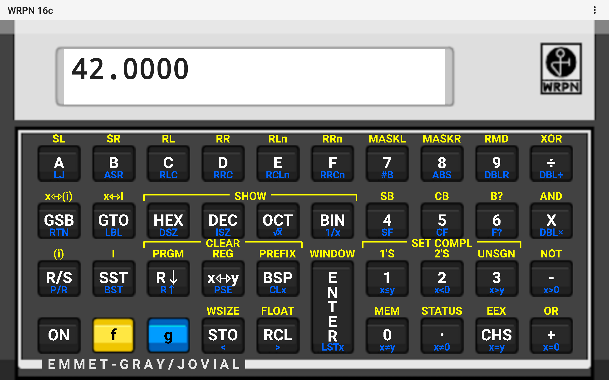
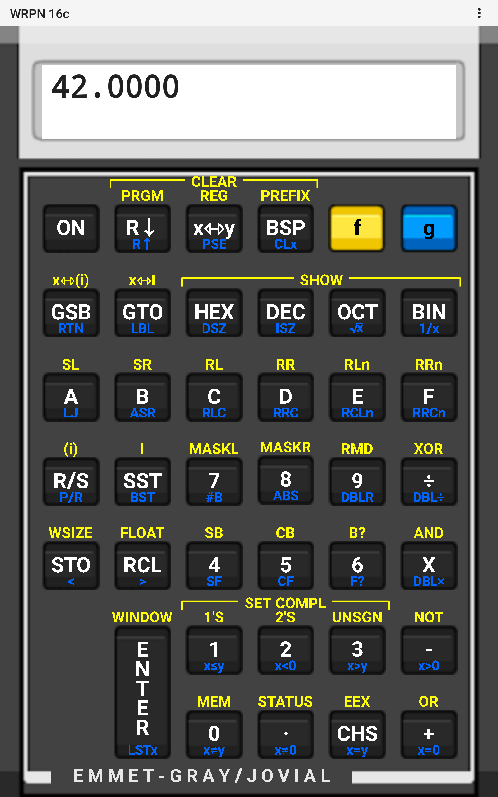

# WRPN, Android version

WRPN is [Emmet Gray's](http://www.emmet-gray.com/) wonderful little
calculator, modeled after the [HP 16-C](https://en.wikipedia.org/wiki/HP-16C).
The original is available at 
[http://www.wrpn.emmet-gray.com/](http://www.wrpn.emmet-gray.com/).
As of this writing, I've basically finished the Android version.
version.  I'm quite happy with how it looks.
It uses fonts to draw the key labels, so they come out nice and 
crisp on big screens.  It looks pretty good on my phone and tablet.

In order to track the changes, I started with the original source, downloaded
on March 19, 2018 from
[https://en.wikipedia.org/wiki/HP-16C](https://en.wikipedia.org/wiki/HP-16C).
I applied a couple of little changes:

   *  I re-created the gradle build from scratch, because that was easier
      than figuring out why IDEA kept telling me to convert to gradle.

   *  There was a stray ">>" instead of ">" in one of the XML files.
      I guess the Android SDK got a little more picky over the years.

   *  I made all the files have Unix-style end-of-line, and I fixed up a
      few files that were assuming tab stops at 4 before doing the initial
      git commit.

Essentially, I did the minimum necessary to get the program to build and
run, with unix-style files (since the commit was from unix).

Note that I started by doing the desktop Java version of WRPN,
over in
[https://github.com/zathras/WRPN_Java](https://github.com/zathras/WRPN_Java).

Here's are full-resolution screen grabs from my tablet, in both portrait
and landscape:

